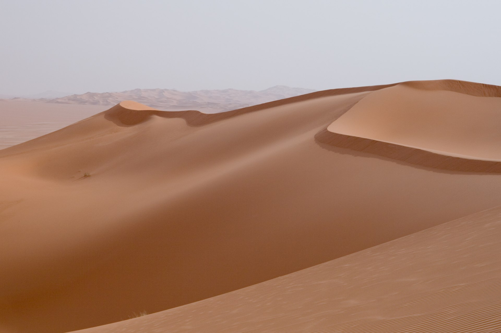

I had some debate last week about "sand" and although you can formulate the
concept as "finely ground rocks", it felt like it was a bit too much extra word
play for what is a common concept. I found a word that also is used as beaches
in the native language. This felt particularly useful as a head word for named
beaches in Hisyëö. I debated also adding a word for gravel but I came up with
this set of terms which I think is fine. Gravel didn't feel nearly as useful in
describing other things as sand did.

<!-- truncate -->

- **Boulder**: ibüwë cënbö
- **Cobble**: ibüwë cüti
- **Very course gravel**: bölfëlë ibüwë yë gemolen yë kocko ëto
- **Coarse gravel**: bölfëlë ibüwë yë gemolen kocko
- **Medium gravel**: bölfëlë ibüwë yë gemolen yë kocko mutyu
- **Fine gravel**: bölfëlë ibüwë yë gemolen lis 
- **Very fine gravel**: bölfëlë ibüwë yë gemolen yë lis ëto
- **Coarse sand**: duwöni yë gemolen kocko
- **Medium sand**: duwöni yë gemolen mutyu
- **Fine sand**: duwöni yë gemolen lis
- **Very fine sand**: duwöni yë gemolen yë lis ëto
- **Silt**: gëkö yë gemolen lis
- **Clay**: lismu

These terms are pulled from the Wentworth grain size chart:

Clearly there isn't enough room for "pebbles", "cobbles", and "boulders" in the
language. But I think these longer compound terms will be fine if you ever need
to describe this level of detail.