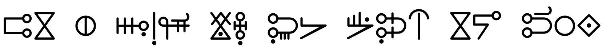

After some discussions on the [Auxlang Discord
server](https://discord.com/channels/379965248565936128/1318647577142624356),
the diacritic used in the Hîsyêô Latin-based orthography will be changed from
the [two dots](https://en.wikipedia.org/wiki/Two_dots_(diacritic)) to the
[circumflex](https://en.wikipedia.org/wiki/Circumflex).

---

cihôû yoûtî xe kôto mût xokôn dîzel hoî [boxô yê yôn Dîskôldu et yê hîskûnco yê
în yôn
nucoto]((https://discord.com/channels/379965248565936128/1318647577142624356)),
solwôc yê yogô ûlonfû fos yôn ni hoî bobôun kon cukto yê xûk Letin et yê
hîskûnco Hîsyêô, ke dî sûn [dûî
bindû](https://en.wikipedia.org/wiki/Two_dots_(diacritic)) mût [ongôlô xe bono
cên](https://en.wikipedia.org/wiki/Circumflex).

<!-- truncate -->

---

This change will eliminate the confusion for those familiar
with how the umlaut vowels are pronounced, or for those familiar with its usage
to denote diaresis, and also in other cases when used for vowel length.

The circumflex is used in some ways which aren't shared with Hîsyêô but there
are at least a few examples of natural languages where it is used for vowel
height which is one aspect of the vowel shift that occurs in Hîsyêô.

This also means that the [dotless i](https://en.wikipedia.org/wiki/Dotless_I)
⟨ı⟩ will not be used anymore because there is no longer a need for
distinguishability between ⟨i⟩ and ⟨î⟩. The removal of the dotless i means that
the software compability situation for this language is greatly improved.

The Latin-based orthography is still only half of the currently available
writing systems. There is a third syllabary that is in development (example
above) which will be made available as a free open source font and also provided
for all the documentation on this website.