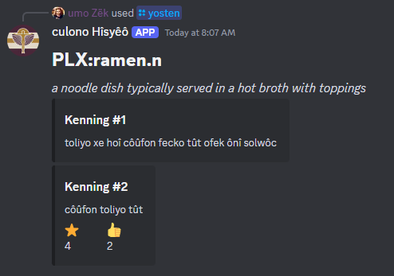

kûu wuîtsî xe golo, oxon yoûtî dêtoî yê môtowo nêôs ûn yoûtî dônûxin lolû ûn yôn
yê nec nucoto et zelen. kûu dîyondê lôîcôk; nîmû ke yûnyoû yôk zîcoû oxon xe
doknû hîzon nîmû ze.

---

Read on for some details about new content, a few word changes and an upcoming
bot tool. Just be careful, you won't be able to hold in your excitement!

<!-- truncate -->

## Change Some Source Words

The sources for "they", "bad", "we/us", and "moving" were changed to help with
partial collision concerns. The source for "three" was changed to remove a
fricative onset which would appear frequently after the fricative coda in the
word for "ten".

## Fix "authorized" transliteration

Transliteration approach that was utilized here was reevaluated and is hopefully
much easier to recognize.

## Source Family Fixes & Word Change

During the process of writing the language transliterations lesson section,
there were several mistaken language families that must not have been fixed
after a previous word change was done. Because of this, there was a slight
imbalance in the language families and the Nakh-Daghestani language family was
missing a word. Because these smaller language families can often present
numerous challenges due to the limited lexicon and phonology resources
available, it was decided that there would need to be an immediate re-alignment
of at least one word. During the same fixes, the Indo-Aranian family had some
extra words beyond the threshold. Since this family has the largest word count
at 107 words, it could handle losing one. After some research, the "nose" source
was changed from **nosîko** to **mêloc**.

## Add word for "cousin"

While doing the family tree, it was identified that the approach for "cousin"
was cumbersome because (1) family is important, (2) some users familiar with
isolating languages will want to use family words as pronouns, and (3) this word
also generally means "kin" which seems more useful than I was giving "cousin" on
its own.

## Add Code Of Conduct & Community Links

A small over-arching [code of conduct](/docs/community#expectations) was added
to the community tab alongside a whole bunch of [community
links](/docs/community#how-can-i-join-the-community) that I've been setting up
around the internet. Looking forward to speaking with some folks about the
language very soon!

## Fix Search Engine For New Diacritics

After the diacritic engine, it was identified by happenstance that the search
engine no longer works. This was due to the search engine still being configured
for the old diacritics. After that, the only thing remaining for diacritic
cleanup is the Deckademy and that is due to the lack of an automated solution to
updating the course. Originally the plan was to just start building the new
course with the smaller lexicon breakdown but there's still many other irons in
the fire and wrapping up the documentation and bot tools will free up a lot of
time for creating video content to support the new course.

## Finish Several Lessons

The last few bits of [Numbers, Dates, & Time](/docs/lessons/numbers-dates-time)
and [Greetings & Salutations](/docs/lessons/greetings-salutations) were finally
added. Some outstanding details about dates and invitations have been added and
the documents polished up. 

Additionally, [Small Talk](/docs/lessons/small-talk) and [Home &
Country](/docs/lessons/home-and-country) have been added and completed. Many
conversational examples added and lots of transliterations of countries and
languages.

## Next Steps

There's still lots of lessons to add. The next one will be about occupations,
chores, and living arrangements. After that, we get into food and drink.

In addition to lessons, Planning has begun on some **guides** for topics like
math, biology, and philosophy. Guides are intended for deeper specializations
into specific subjects and there will likely be many more of these.

Outside of the writing, there is also intermittent work being put into a Discord
bot which will allow for searching the core Hîsyêô words, proper/class words,
and compound words. Additionally, knowledgeable speakers will be able to start
adding their own compounds and voting on those added by others.

The Discord bot already has some of this functionality implemented and
additionally has the ability to transliterate Hîsyêô between the three scripts.
Come join the server to give it a try!

noyo xîwon xe monodo môî nîmû bi zelen hoî boxo yê nec nucoto yê hîskûnco Hîsyêô ze.

import MastodonPostSvg from './mastodon.svg'

<blockquote class="mastodon-embed"
            data-embed-url="https://mastodon.social/@hisyeo/114215391370015766/embed"
            style={{
                background: "#FCF8FF",
                "border-radius": "8px", border: "1px solid #C9C4DA", margin: 0,
                "max-width": "540px", "min-width": "270px", overflow: "hidden", padding: 0}}>
    <a href="https://mastodon.social/@hisyeo/114215391370015766"
       target="_blank"
       style={{
            "align-items": "center",
            color: "#1C1A25",
            display: "flex",
            "flex-direction": "column",
            "font-family": "system-ui, -apple-system, BlinkMacSystemFont, 'Segoe UI', Oxygen, Ubuntu, Cantarell, 'Fira Sans', 'Droid Sans', 'Helvetica Neue', Roboto, sans-serif",
            "font-size": "14px",
            "justify-content": "center", "letter-spacing": "0.25px", "line-height": "20px", "padding": "24px", "text-decoration": "none"}}>
        <MastodonPostSvg />
        
Post by @hisyeo@mastodon.social

        
View on Mastodon

    </a>
</blockquote>
