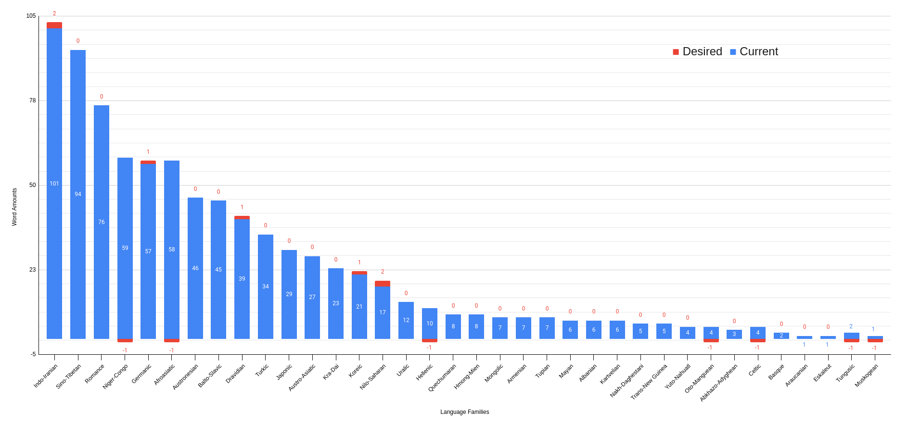

import Tabs from '@theme/Tabs';
import TabItem from '@theme/TabItem';
import HisyeoTabs from '@site/src/components/HisyeoTabs'
import HisyeoText from '@site/src/components/HisyeoText'
import HisyeoTooltip from '@site/src/components/HisyeoTooltip'

# First Steps

What is this language and how do you pronounce it?

## World Language

Hîsyêô is a *world* language and *art* language that attempts to create a
batteries-included opinionated platform for cultural expression.

It takes words from all of the world's families of languages so that there is a
little of everyone's language within it. Each language family gets a
proportional amount of words. The proportion size is determined by taking the
percentage of the total of the square roots of recent counts of the L1
population speakers of each language. By using a square root distribution, the
larger language families have a reduced proportion and the lesser families have
a slightly increased proportion. These amounts are considered a tolerance marker
and each family fluctuates between position and negative offsets from the
tolerance amount.

This principle allows Hîsyêô to have a representation of as many people as
possible. Since the larger language families get a large amount of words due to
the proportioning (even in a square root distribution), it ends up making their
language learning experience better than others. To combat this, smaller
language families always get prioritization when conflicts arise and new words
need to be located. This only makes a minor impact on the major language
families but greatly impacts the minor ones.

:::caution Not Your Native Language

While words are being taken from languages it is important to remember that this
language is not your native language, you will need to abandon any other rules
or word changes that you might normally make. Each Hîsyêô content word can be
used as a noun, verb, or modifier so there's a good chance it will be used in a
way that seems wrong to your native language's grammar.

**This is okay.** Try to focus on the essence of that native language word,
imagine it being translated as the other parts of speech (aka word classes). Now
think of the Hîsyêô word as covering **all** of these words. This is why we
include all of the different derivation translations in each definition, so that
you can familiarize yourself with all the ways it can be utilized. The preceding
word in the sentence will tell you which derivation is being expressed.

:::

## Art Language

Hîsyêô is also an art language because there are many aesthetic, syntactic, and
semantic ideas that go beyond just a plain auxiliary platform of communication.
These aspects allow it to be used as an everyday communication platform right
now albeit with a starting "culture" in a similar way to how art language
creators write history to explain their language's idiosyncracies. The cultural
lexicon of Hîsyêô is a representation of what the creators believe to be
- the fundamentals of a modern democratic society
- the necessary critical tools to authentically discuss bad things
- the literary and poetic capability to be fun, whimsical, and wild 

That being said, there are no mythological stories to anchor you like you might
find in a natural society (and also in artlangs). Because of this, there's a
risk that these ideas will fade as the language gains a true living culture. The
community must remain vigilant that the things that make Hîsyêô great never fade
but they must also be ever watchful for aspects of the culture that bring
negativity or fascism. Hopefully, with time, stories will be written and printed
for broad circulation.

## Common Expressions

Until there are volumes of Hîsyêô writings to consume, we will have to make due
with oral communication. The first step on the road to oral communication is to
learn the common phrases that are the lifeblood of any encounter with a Hîsyêô
speaker. These words sometimes take on additional roles as interjections and
simple sentences. Learning these will make it much easier to engage in polite
and impolite conversation and get your feet wet so that you can begin your
immersion training.

:::info Examples

The following are some of the current established expressions that Hisyêans use
in day-to-day conversation. Context can often allow for some constituents to be
omitted; these parts will be surrounded in parentheses. Further still, some
grammatical elements have already been omitted due to syntactic drop rules but
these will be absent in translation examples except where the rules are
explained.

<HisyeoTabs>
    
foxo.&emsp;<em>woah!</em>

    
nûs kûu li nô cî.&emsp;<em>Let's go!</em>

    
(nîmû) (li gô) bi zik.&emsp;<em>How are you doing?</em>

    
(noyo) (li gô) bi xôn.&emsp;<em>I am well.</em>

    
lono nîmû li sî gô bi zik.&emsp;<em>How has your day been?</em>

    
(ni) (li gô) bi yôk xôn.&emsp;<em>Not good.</em>

    
zik li yonlûs.&emsp;<em>What's wrong?</em>

    
(ni) li yôk sonkon&emsp;<em>It doesn't matter.</em>

    
kûu yûnlôn (noyo).&emsp;<em>Sorry!</em>

    
kûu li yôk cînzon.&emsp;<em>Don't worry!</em>

    
(noyo) li konxo (hôn nîmû).&emsp;<em>Thank you!</em>

    
(ni) li yôk îxôlô.&emsp;<em>It's not a problem.</em>

    
(ni) li xûnyu (uyo).&emsp;<em>It's nothing. (You're welcome.)</em>

    
noyo kôî dî hoî lîmîen ko.&emsp;<em>Can I come in?</em>

</HisyeoTabs>
:::

## Pronunciation

Learning how to pronounce the words requires learning how each of the 24
phonemes work and how they combine to form syllables. Each translation has a
wide array of acceptable alternatives that you can use if certain sounds are too
challenging. The distance between each sound can be subtle in certain words and
with certain speakers but *all of the words of Hîsyêô were chosen in such a way
that there shouldn't be any two words that have pronunciations which would be too
difficult to differentiate*.

### Alphabet

Let's go through each phoneme and what similar sounds can also be used. All
example words are pronounced as in US English. Take a look at the [Sounds](../intro#sounds) section
of the introduction for some other English dialects.

#### Vowels

##### o - [open back unrounded vowel](https://en.wikipedia.org/wiki/Open_back_unrounded_vowel) [ɑ]
- as in sl**o**t or f**a**ther
- can also be other open vowels: [a], [ɶ], [ɒ], 

##### ô - [open-mid back rounded vowel](https://en.wikipedia.org/wiki/Open-mid_back_rounded_vowel) [ɔ]
- as in r**o**pe or Camb**o**dia
- can also be more close-mid [o]
- *slightly geminated*

##### e - [open-mid front unrounded vowel](https://en.wikipedia.org/wiki/Open-mid_front_unrounded_vowel) [ɛ]
- as in b**e**d or c**a**t
- can also be other open-mid front vowels: [æ], [œ]

##### ê - [close-mid front unrounded vowel](https://en.wikipedia.org/wiki/Close-mid_front_unrounded_vowel) [e]
- as in m**a**y or f**a**ce
- can also be rounded [ø]
- *slightly geminated*

##### i - [near-close near-front unrounded vowel](https://en.wikipedia.org/wiki/Near-close_near-front_unrounded_vowel) [ɪ]
- as in c**i**ty or w**i**ll
- can be rounded [ʏ]
- and the close central unrounded vowel [ɨ]
- lastly, can be the close-mid central unrounded vowel [ɘ]

##### i - [close front unrounded vowel](https://en.wikipedia.org/wiki/Close_front_unrounded_vowel) [i]
- as in happ**y** or c**ei**ling
- can also be rounded [y]
- *slightly geminated*

##### u - [open-mid back unrounded vowel](https://en.wikipedia.org/wiki/Open-mid_back_unrounded_vowel) [ʌ]
- as in r**u**n or en**ou**gh
- can also be other central and back undrounded vowels: [ə], [ɜ]. [ɐ], [ɤ]

##### û - [close back rounded vowel](https://en.wikipedia.org/wiki/Close_back_rounded_vowel) [u]
- as in l**o**se, thr**ou**gh
- can also be other back rounded and unrounded vowels: [ʉ], [ɯ], [ʊ]
- *slightly geminated*

#### Consonants

##### h - [voiceless glottal fricative](https://en.wikipedia.org/wiki/Voiceless_glottal_fricative) [h]
- as in **h**am or **h**old
- can also be velar, pharyngeal, or uvular voiceless fricatives: [x], [ɣ], [ʁ], [ħ]

##### k - [voiceless velar plosive](https://en.wikipedia.org/wiki/Voiceless_velar_plosive) [k]
- as in **c**up or sti**ck**
- can also be the uvular voiceless plosive [q]

##### g - [voiced velar plosive](https://en.wikipedia.org/wiki/Voiced_velar_plosive) [g]
- as in **g**old or sna**g**
- can also be the uvular voiced plosive [ɢ]

##### t - [voiceless dental/alveolar plosive](https://en.wikipedia.org/wiki/Voiceless_dental_and_alveolar_plosives) [t]
- as in **t**ip or pu**tt**
- can also be the retroflex equivalent [ʈ]

##### c - [voiceless postalveolar affricate](https://en.wikipedia.org/wiki/Voiceless_postalveolar_affricate) [t͡ʃ]
- as in **ch**ore or na**t**ure
- can also be alveolar or retroflex: [t͡ɕ], [ʈ͡ʂ]

##### s - [voiceless alveolar fricative](https://en.wikipedia.org/wiki/Voiceless_alveolar_fricative) [s]
- as in mi**s**t or i**c**e
- can be either voiceless or voiced [z]

##### x - [voiceless postalveolar fricative](https://en.wikipedia.org/wiki/Voiceless_postalveolar_fricative) [ʃ]
- as in a**sh** or ra**t**ion
- can be either voiceless or voiced [ʒ]

##### d - [voiced dental/alveolar plosive](https://en.wikipedia.org/wiki/Voiced_dental_and_alveolar_plosives) [d]
- as in **d**ig or ba**d** 
- can also be the retroflex equivalent [ɖ]

##### z - [voiced postalveolar affricate](https://en.wikipedia.org/wiki/Voiced_postalveolar_affricate) [d͡ʒ]
- as in **j**og or a**g**e
- can also be alveolar or retroflex: [d͡ʑ], [ɖ͡ʐ]

##### b - [voiced bilabial plosive](https://en.wikipedia.org/wiki/Voiced_bilabial_plosive) [b]
- as in **b**rown or ji**b**
- can be either voiced or voiceless [p]

##### f - [voiceless labiodental fricative](https://en.wikipedia.org/wiki/Voiceless_labiodental_fricative) [f]
- as in **f**ree or ba**ff**le
- can be either voiceless or voiced [v]

##### m - [voiced bilabial nasal](https://en.wikipedia.org/wiki/Voiced_bilabial_nasal) [m]
- as in la**m**b or **m**ineral
- can be labio-dental [ɱ]

##### n - [voiced dental/alveolar nasal](https://en.wikipedia.org/wiki/Voiced_dental,_alveolar_and_postalveolar_nasals) [n]
- as in **n**od or ba**n**
- can be any other nasal: [ɳ], [ɲ], [ŋ], [ɴ]

##### w - [voiced labial–velar approximant](https://en.wikipedia.org/wiki/Voiced_labial%E2%80%93velar_approximant) [w]
- as in **w**eep or a**w**ake
- try to avoid realizing as [ʋ] due to similarity to voiced labiodental fricative.

##### l - [voiced dental/alveolar lateral approximants](https://en.wikipedia.org/wiki/Voiced_dental,_alveolar_and_postalveolar_lateral_approximants) [l]
- as in **l**inger or ba**ll**ad
- can also be realized as retroflex [ɭ] or tap/flap [ɾ]
- most rhotic phonemes are transliterated as this letter

##### y - [voiced palatal approximant](https://en.wikipedia.org/wiki/Voiced_palatal_approximant) [j]
- as in **y**earn or ma**y**o
- especially when preceded by a lateral approximant, this phoneme can be
  realized as a palatal lateral approximant [ʎ]

Check out the [phonology reference](../language/phonology) for more details.

<HisyeoTooltip />